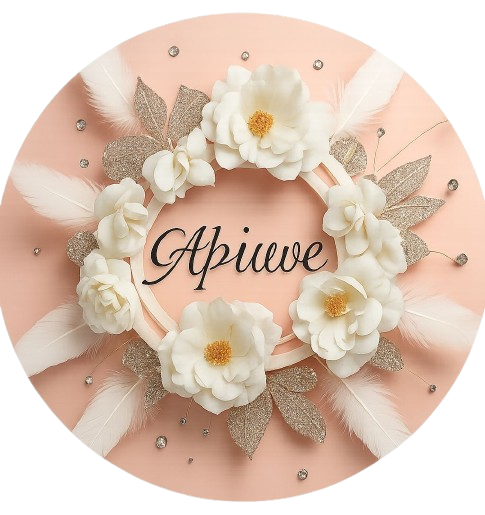
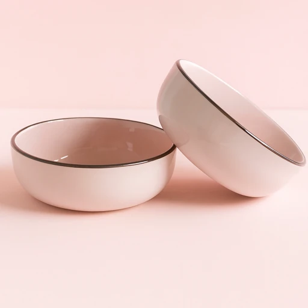
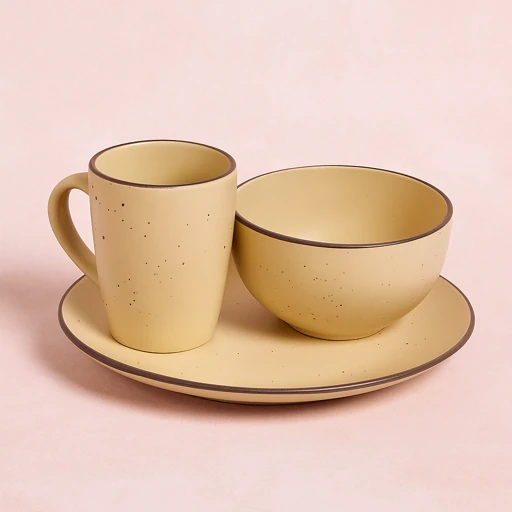
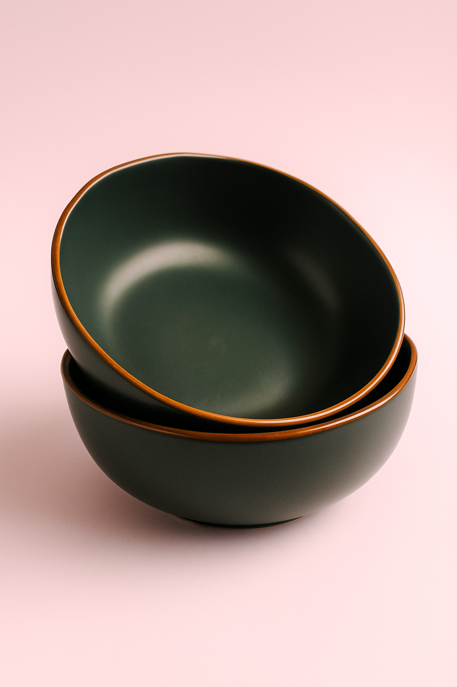

<!DOCTYPE html>
<html lang="en">
<head>
    <meta charset="UTF-8">
    <meta name="viewport" content="width=device-width, initial-scale=1.0">
    <title>Elegance - Handcrafted Plates</title>
    <!-- Tailwind CSS CDN -->
    
    <!-- Google Fonts -->
    <link rel="preconnect" href="https://fonts.googleapis.com">
    <link rel="preconnect" href="https://fonts.gstatic.com" crossorigin>
    <link href="https://fonts.googleapis.com/css2?family=Inter:wght@400;500;600;700&family=Playfair+Display:wght@400;500;600;700&display=swap" rel="stylesheet">
    <!-- Font Awesome for icons -->
    <link rel="stylesheet" href="https://cdnjs.cloudflare.com/ajax/libs/font-awesome/6.4.0/css/all.min.css">
    
</head>
<body class="bg-gray-50 text-gray-800">

    

        <!-- Header/Navigation -->
        <header class="sticky top-0 z-50 bg-white shadow-sm">
            <nav class="container mx-auto px-4 sm:px-6 lg:px-8 py-4 flex justify-between items-center">
                <!-- Logo with corrected image source -->
                
                
                <!-- Desktop Navigation Links -->
                <ul class="hidden md:flex space-x-8 text-lg">
                    <li><a href="#hero" class="hover:text-indigo-600 transition-colors duration-300">Home</a></li>
                    <li><a href="#products" class="hover:text-indigo-600 transition-colors duration-300">Products</a></li>
                    <li><a href="#about" class="hover:text-indigo-600 transition-colors duration-300">About</a></li>
                    <li><a href="#contact" class="hover:text-indigo-600 transition-colors duration-300">Contact</a></li>
                </ul>

                <!-- Shopping Cart Icon & Mobile Menu Button with basket count -->
                

                    <button id="cart-button" class="relative text-xl text-gray-600 hover:text-indigo-600 transition-colors duration-300 focus:outline-none">
                        <i class="fas fa-shopping-cart"></i>
                        0
                    </button>
                    <button id="mobile-menu-button" class="md:hidden text-xl text-gray-600 focus:outline-none">
                        <i class="fas fa-bars"></i>
                    </button>
                

            </nav>

            <!-- Mobile Menu (Hidden by default) -->
            

                <ul class="flex flex-col items-center space-y-4 text-lg">
                    <li><a href="#hero" class="block py-2 hover:bg-gray-100 w-full text-center" onclick="toggleMobileMenu()">Home</a></li>
                    <li><a href="#products" class="block py-2 hover:bg-gray-100 w-full text-center" onclick="toggleMobileMenu()">Products</a></li>
                    <li><a href="#about" class="block py-2 hover:bg-gray-100 w-full text-center" onclick="toggleMobileMenu()">About</a></li>
                    <li><a href="#contact" class="block py-2 hover:bg-gray-100 w-full text-center" onclick="toggleMobileMenu()">Contact</a></li>
                </ul>
            

        </header>

        <!-- Hero Section -->
        <section id="hero" class="hero-background min-h-screen relative flex items-center py-20 animate-fadeIn overflow-hidden">
            <!-- Semi-transparent overlay for text readability -->
            

            <!-- Floating circles background -->
            

                

                

                

                

            

            

                

                    <h1 class="text-5xl md:text-6xl lg:text-7xl font-bold leading-tight">
                        Crafted for moments, designed for life.
                    </h1>
                    

                        Discover our exquisite collection of handcrafted plates, where artistry meets utility.
                    

                    <a href="#products" class="inline-block px-8 py-4 bg-indigo-600 text-white font-semibold text-lg rounded-full shadow-lg hover:bg-indigo-700 transition-all duration-300">
                        Shop the Collection
                    </a>
                

            

        </section>

        <!-- Featured Products Section -->
        <section id="products" class="py-20 bg-gray-50 animate-fadeIn">
            

                

                    <h2 class="text-4xl md:text-5xl font-bold text-gray-900 mb-4">Our Signature Collections</h2>
                    

                        Explore our best-selling collections, meticulously crafted to elevate your dining experience.
                    

                

                

                    <!-- Product Card 1 -->
                    

                        <!-- Updated image source for product 1 -->
                        
                        

                            <h3 class="text-2xl font-semibold text-gray-900 mb-2" data-name="The Earthstone Collection">The Earthstone Collection</h3>
                            
A blend of organic texture and modern design.

                            R45.00
                            <button class="add-to-basket-btn mt-4 w-full px-6 py-3 bg-gray-900 text-white font-semibold rounded-full hover:bg-gray-700 transition-colors duration-300">
                                Add to Basket
                            </button>
                        

                    

                    <!-- Product Card 2 -->
                    

                        <!-- Updated image source for product 2 -->
                        
                        

                            <h3 class="text-2xl font-semibold text-gray-900 mb-2" data-name="The Porcelain Series">The Porcelain Series</h3>
                            
Delicate, timeless, and effortlessly elegant.

                            R60.00
                            <button class="add-to-basket-btn mt-4 w-full px-6 py-3 bg-gray-900 text-white font-semibold rounded-full hover:bg-gray-700 transition-colors duration-300">
                                Add to Basket
                            </button>
                        

                    

                    <!-- Product Card 3 -->
                    

                        <!-- Updated image source for product 3 -->
                        
                        

                            <h3 class="text-2xl font-semibold text-gray-900 mb-2" data-name="The Modernist Set">The Modernist Set</h3>
                            
Clean lines and minimalist perfection.

                            R50.00
                            <button class="add-to-basket-btn mt-4 w-full px-6 py-3 bg-gray-900 text-white font-semibold rounded-full hover:bg-gray-700 transition-colors duration-300">
                                Add to Basket
                            </button>
                        

                    

                

            

        </section>

        <!-- About Us Section -->
        <section id="about" class="py-20 bg-blue-50 animate-fadeIn">
            

                

                    
                

                

                    <h2 class="text-4xl md:text-5xl font-bold text-gray-900 mb-4">Our Story</h2>
                    

                        Founded on a passion for craftsmanship and timeless design, Elegance is more than just a brand—it's a celebration of mindful living. Each plate is a work of art, shaped by skilled hands and fired with care, bringing a touch of intentional beauty to every meal.
                    

                    

                        We believe that the objects we use every day should tell a story. That's why we source our materials ethically and pour our hearts into every piece we create.
                    

                

            

        </section>

        <!-- CTA Section -->
        <section class="py-20 bg-gray-900 text-white text-center animate-fadeIn">
            

                <h2 class="text-4xl md:text-5xl font-bold mb-4">Ready to Elevate Your Dining?</h2>
                

                    Join our community and be the first to know about new collections, exclusive offers, and behind-the-scenes stories.
                

                <a href="#products" class="inline-block px-8 py-4 bg-white text-gray-900 font-semibold text-lg rounded-full shadow-lg hover:bg-gray-200 transition-all duration-300">
                    Explore Our Full Collection
                </a>
            

        </section>

        <!-- Footer -->
        <footer id="contact" class="bg-gray-900 text-gray-300 py-12 animate-fadeIn">
            

                

                    <a href="tel:0748482314" class="text-xl hover:text-white transition-colors duration-300" aria-label="Call on WhatsApp"><i class="fab fa-whatsapp"></i></a>
                    <a href="https://www.tiktok.com/@aphiwetofile7?_t=ZM-8yWY47u0RGP&_r=1" target="_blank" class="text-xl hover:text-white transition-colors duration-300" aria-label="Visit our TikTok page"><i class="fab fa-tiktok"></i></a>
                    <a href="#" class="text-xl hover:text-white transition-colors duration-300"><i class="fab fa-instagram"></i></a>
                    <a href="#" class="text-xl hover:text-white transition-colors duration-300"><i class="fab fa-pinterest-p"></i></a>
                    <a href="#" class="text-xl hover:text-white transition-colors duration-300"><i class="fas fa-envelope"></i></a>
                

                
&copy; 2025 Elegance. All rights reserved.

            

        </footer>
    

    <!-- The Modal for the order summary -->
    

        

            &times;
            <h3 class="text-2xl font-bold text-gray-900 mb-4">Your Order</h3>
            

            <button id="order-whatsapp-btn" class="w-full px-6 py-3 bg-green-600 text-white font-semibold rounded-full hover:bg-green-700 transition-colors duration-300">
                Order via WhatsApp
            </button>
        

    

    
</body>
</html>
